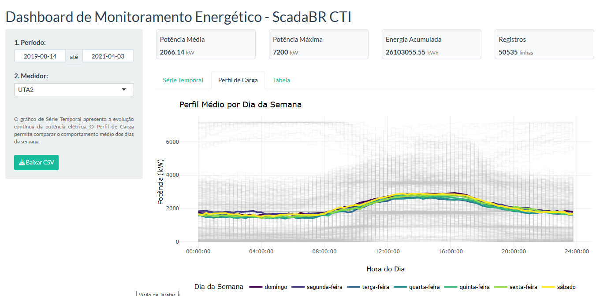

# Análise Energética do CTI Renato Archer

Este repositório reúne os estudos, algoritmos e aplicações desenvolvidos para análise de dados energéticos provenientes do sistema supervisório ScadaBR do CTI Renato Archer. O projeto tem como foco a utilização de dados históricos para compreensão do comportamento operacional e energético da infraestrutura monitorada, permitindo transformar informações brutas em indicadores técnicos e visualizações analíticas.

Os dados utilizados são obtidos a partir do banco de dados integrado ao ScadaBR, sendo posteriormente tratados e processados em R. A partir desse fluxo, são realizadas análises temporais, cálculos estatísticos e modelagens voltadas ao acompanhamento do consumo energético, demanda elétrica e comportamento dos grupos consumidores ao longo do tempo.

O desenvolvimento contempla desde a importação e estruturação das bases históricas até a geração de dashboards interativos e relatórios técnicos, permitindo maior rastreabilidade dos dados e suporte à tomada de decisão operacional.

O projeto também busca consolidar uma base analítica reutilizável para futuras aplicações em monitoramento inteligente, detecção de padrões e modelos preditivos.

## Algoritmo

Foram desenvolvidos dois algoritmos principais para importação, tratamento e análise dos dados energéticos.

O primeiro consiste em uma aplicação executada diretamente no RStudio, com abordagem mais analítica e individual para cada medidor monitorado. Esse algoritmo permite a geração de gráficos de perfil de carga por dia da semana, além do cálculo de médias de consumo e análises comparativas entre períodos operacionais.

O segundo corresponde a uma aplicação mais completa e interativa desenvolvida com Shiny, incorporando visualizações dinâmicas, séries temporais, tabelas analíticas e dashboards operacionais. Essa aplicação possibilita uma exploração mais ampla dos dados históricos, facilitando o acompanhamento do comportamento energético e a interpretação dos indicadores gerados.

Os algoritmos podem ser acessados nos links abaixo:

* [**1. Acessar algoritmo em R**](https://github.com/ScadaBR-CTI/analise-dados-r/blob/main/scripts/01_mysql_import.R)
* [**2. Acessar algoritmo em R**](https://github.com/ScadaBR-CTI/analise-dados-r/blob/main/scripts/Carga_CTI_Shiny.R)

### Dashbords com o Shiny

  

## Objetivo

Avaliar padrões de consumo, demanda elétrica e comportamento operacional dos grupos consumidores da instituição.

## Tecnologias Empregadas

O ambiente de desenvolvimento e análise é composto pelas seguintes tecnologias:

- R / RStudio para processamento, modelagem e análise estatística
- MySQL como camada de armazenamento dos dados históricos
- ScadaBR para aquisição e supervisão operacional
- Shiny para construção de dashboards e aplicações web interativas

## Estrutura do Projeto

- Importação de dados históricos
- Tratamento de séries temporais
- Cálculo de potência média
- Dashboards interativos
- Relatórios técnicos

## Resultados Esperados

Com a consolidação das análises, espera-se obter maior visibilidade sobre o comportamento energético da infraestrutura monitorada, permitindo:

- Identificação de padrões de consumo e horários de pico
- Apoio à gestão e eficiência energética
- Suporte à tomada de decisão técnica
- Identificação de anomalias operacionais
- Formação de base histórica para futuras aplicações de Machine Learning e análise preditiva
